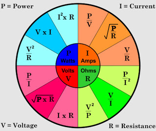
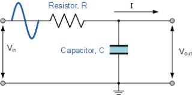
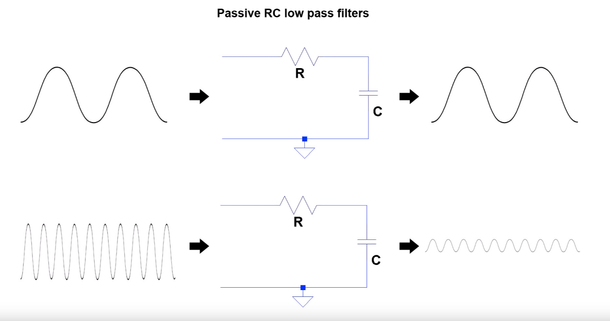
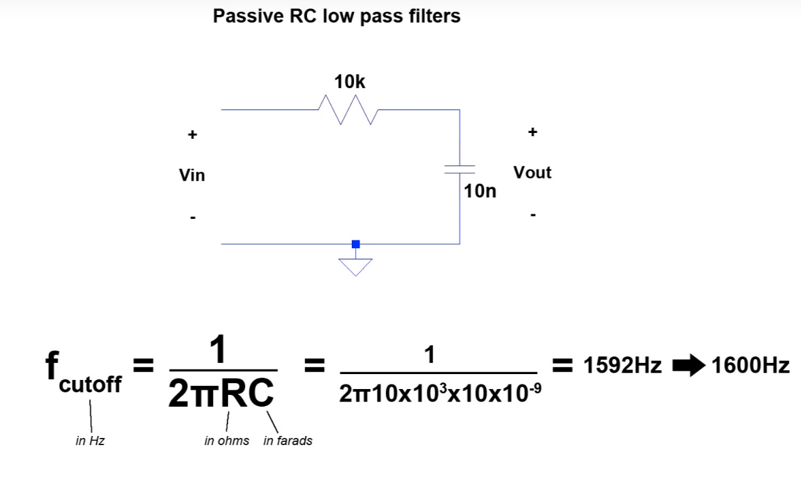

> How to make circuits, what we want them to do?

## Water Analogy

Voltage
: Pressure

Flow
: Current

<!-- more -->
Actuators
: produces motion

breakout-board
:  bundled cable and “breaks out” each conductor to a terminal that can easily accept a hook-up wire for distribution to another device.

* Wirk app to create GUI and mobile apps for IOT

## Basic Electronics laws

1. Ohms Law
2. Kirchhoff's circuit laws
   1. Current entering a junction equals the current leaving the junction

## Standard notations used

Vdd
:Voltage Drain Drain

Vss
:Voltage Source Source

## Capacitors

* Quick surge of charge, otherwise similar to battery[^1]
  * Flash bulbs, cameras, starter motor, audio amplifiers
* DIfferent from Battery as it Can Charge and DIscharge very quickly
* **SMOOTHING** AC current effect, else leds would be flickering
  * When polarity changes, capacitors discharge to provide power supply to circuit

## Components

* Heat Sink - remove heat from delicate componenets and increase their lifetime
  * Thermal Interface Material
    * No 2 metals will meet up perfectly
    * Fill in these micro gaps
* Resistors
  * Control i/p voltage for componenets like LEDs, capacitors etc. to avoid damage to circuit
  * Polarity doesnt matter
* Diods
  * Allows flow of current in one direction and not the other
  * `BC547`
  * POlarity matters
    * Forwars Bias
    * Reverse Bias
  * Breakdown mode
  * Protection Diod
    * PRevents accital damage to circuit when wrong polarity of power is applied
* Hookup wires
  * solid core wire
* Voltage Regulator
  * Takes in regulated voltage and spits out regulated constant voltage
  * New alternative - **Buck converter** or voltage step-down converter
* Switch Mode Power Supply
* Solderless Breadboards are not good for `RF` projects
*

## How to analyze circuits?

*

## Resistor-Capicitor (RC) lowpass Filters

Filter Circuits
: change frequency content of signal
* Music Equalizer settings

Low pass filter - LPF
: is a filter that passes signals with a frequency lower than a selected cutoff frequency
and attenuates signals with frequencies higher than the cutoff frequency.
* https://www.youtube.com/watch?v=OBM5T5_kgdI

> How to create a LPF hardware ?

* Filter introduces a shift in phase
* Changes the signal amplitude
* **Bode Plott**
* cut off frequency[^3] of filter equation

## DIY cheap projects

1. Ice-cream stick single motor car
2. cola Bottle caps as wheels
3. Light thermocol
4. Cheap plastics cups, join them to make interesting shapes
5. Cardboard
6. [Amazing DIY toys](https://youtu.be/HL_xrAFsldY)
7. Plastic bottles as casing
8. Old CD disks
9. Toothpase case

### Similarly

* https://en.wikipedia.org/wiki/RL_circuit
* https://en.wikipedia.org/wiki/LC_circuit
* https://en.wikipedia.org/wiki/RLC_circuit

What is Inductance?
: https://www.youtube.com/watch?v=ukBFPrXiKWA
* Magnetic fields do not like to change

### Footnotes

[^1]: https://www.youtube.com/watch?v=5hFC9ugTGLs
[^2]: [3D printing online service](https://www.3dhubs.com/)
[^3]: https://en.wikipedia.org/wiki/Cutoff_frequency
