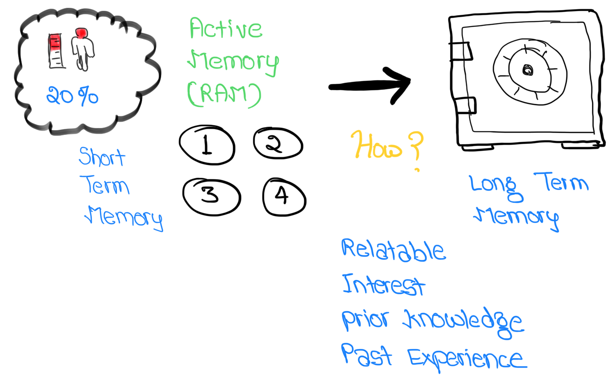

If you are one us mere mortals, then you dont remember what you should and it takes too much time to memorise.

{}
By organizing scattered bits of information into pattern of knowledge, schema gives
depth and richness to our thinking.
Understanding and intelligence is derived largely from the schema we have acquired
over long period of time.
{}

> Recall (using queues) vs Recognition, dont confuse them
<!-- more -->

* Every memory is stored in a **neural pathway**
* Every brain is connected differently
* For NEW INFORMATION, we must provide multiple entry-points
  * Interests, hobbies
  * prior knowledge
  * past experiences
* Once we reach limits of of our working memory (RAM), it becomes harder to distinguish between relevant
  and irrelevant information, signals from noise. We become mindless consumers of data. Information overload

{}
Brain works more like a MUSCLE, contrary to what people think that its like COMPUTER.
Neurons that FIRE together, wire together.
{}

Cognitive Conflict
: Learning by reconciling new things with old things
* we must motivate ourself to resolve our cognitive conflict. That's when real long term learning begins.

Intellectual Humility
: make disagreements more constructive

{}
* Language Learning
  * [Repos on github](https://github.com/topics/language-learning)
  * [Repos tagged spacd repetition](https://github.com/topics/spaced-repetition)
  * [Language Learning Toolkit](https://github.com/lltk/lltk)
  * [Quizlet Approach](https://medium.com/tech-quizlet/spaced-repetition-for-all-cognitive-science-meets-big-data-in-a-procrastinating-world-59e4d2c8ede1)
  * [wikiDictionary API](https://en.wiktionary.org/w/api.php)
  * [Translate API example](https://www.chlehr.com/blog/2019-05-01-build-your-own-translator-with-vue/)
{}

## Problem[^1]

> How to promote motivation to resolve cognitive conflict?

1. After reading, watching a video or listening to something you feel like you are know, but actually you don't. We trick ourself thinking we are competent.

3 ingredients

1. Autonomy, make meaningful choices, sense of empowerment
2. Connection, between each other and to the real world
3. Curiosity in pursuit of mastery, balance b/w **challenge** and **ability**. `State of flow`
4. Self -reflection

{}
The person who says he knows what he thinks but cannot express it usually does not know what he thinks.

Feeling informed VS truly understanding something
{}

## Methods to commit to Long Term Memory

1. Recall, active (also make it physical with SENSES) learning
2. Feynman Technique
   1. avoid convoluted language
   2. Use ANALOGIES
3. Spaced Repetition



## Learning Schedule

The Fibonacci numbers 1,2,3,5,8,13,21,34,55,89,144,233,377…

Why Fibonacci Sequence is the best spaced repetition schedule to remember vocabulary

## Tools to use

* https://github.com/lltk/Koko
*


### ANKI

is content-agnostic and supports images, audio, videos and scientific markup (via LaTeX), the possibilities are endless. For example:

* learning a language
* studying for medical and law exams
* memorizing people’s names and faces
* brushing up on geography
* mastering long poems
* even practicing guitar chords!

### Use a Text-to-Speech software

Google API

```
espeak -v german 'Guten Morgen'
```
* [Python pyttsx3 module](https://pypi.org/project/pyttsx3/)
* [Google Sheets python API to read spreadsheet](https://developers.google.com/sheets/api/quickstart/python)


echo "Guten Morgen" | espeak [[[-v de]]] [[[-s 150]]] [[[-w]]] guten-morgen.wav [[[-z]]] [[[-x]]]


1. Use german $voice$
2. Set speeach rate/speed to 150 (slower). Default is 160
3. Save audio file as `wav` format
4. No final sentence pause at the end of the text
5. Write **phoneme mnemonics** to stdout


---

* Use image occulusion tools
* Put images on website and then use links in anki!
* Make your own condensed sheets
* `Active` vs `passive` learning. Rewatching whole content material is waste of time. Review notes
1. Make languauge learning translation decks from Google Phrasebook
2. Add Google Translate Audios to your decks using [awesome TTS](https://ankiweb.net/shared/info/301952613)
3. [Quizlet](https://quizlet.com/)
4. Google SHeets, and slides for collaborative learning
5. Use FACT based Flashcards, make good flashcards
6. Ask a native speaker to read the text for you, record it and break it into audio clippings

## Learning Strategies

1. Active Learning - learn whats important and RECALL
2. Flashcards (Anki)
3. Mnemonics
4. Memory Palace / Method of Loci
5. Reviewing each method regularly

### Food for thought

1. Will I enjoy sitting in the class, all day, everyday?
2.

## How to learn a languages

1. [Get 1k most commonly used words of the language](https://1000mostcommonwords.com/1000-most-common-german-words/)[or from wikimedia website](https://en.wiktionary.org/wiki/Wiktionary:Frequency_lists#German)
2.

[Interesting facts about brain](https://faculty.washington.edu/chudler/ffacts.html)

## SRS - Spaced Repitition System

Techniques and methods

+ The Leitner Box System[^2]

### Apps and Softwares

[List of flashcard softwares](https://en.wikipedia.org/wiki/List_of_flashcard_software)

+ [cram](https://www.cram.com/)
+ [Brainscape](https://www.brainscape.com)

## How to learn language?

* [Comprehensable Input](https://youtu.be/fnUc_W3xE1w)
* FOcused and Diffused learning modes
* Shadowing
* stoicism

## War of Art

> What have you grown the most, most fun with, honored my true self the most?
What are the things you want to-do and are scared of?
Figure out that and pursue it.
GUARENTEE: You will see more growth and fuilfillment from that journey than anythign else you could do in life


### Footnotes

[^1]: [yt, how to leanr](https://youtu.be/V-UvSKe8jW4)
[^2]: [wiki, Leitner Box System](https://en.wikipedia.org/wiki/Leitner_system)
[Anki, Learning Hell, longer intervals](https://youtu.be/1XaJjbCSXT0)
